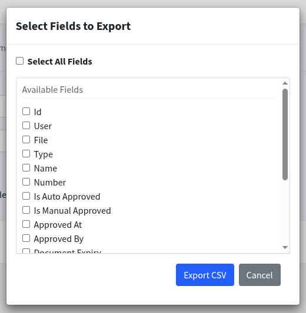

# 🚀 Django Admin CSV Export

A reusable Django app that adds **CSV export functionality** to the Django admin with:
- A **modal dialog** for selecting fields to export
- **Streaming CSV responses** (handles large querysets without memory issues)
- **Secure logging** to prevent log injection attacks
- **Auto-generated** filenames with timestamps

---

## ✨ Features

- 📊 CSV export directly from the Django Admin.
- ⚡ Memory-efficient streaming (great for large datasets).
- 🔒 Safe logging + filename sanitization.
- 🎛️ User-friendly modal for field selection.
- 🛠️ Configurable (choose/export fields, exclude sensitive ones, set chunk size, custom filenames).

---

## 📦 Installation

1. Copy the `csv_export_mixin` module into your Django project.
2. Add your custom admin class with the mixin.

---

## 🗂️ Project Structure

```bash
.
├── csv_export_mixin
│   ├── csv_export_mixin.py
│   ├── csv_export_utils.py
│   └── __init__.py
├── LICENSE
├── README.md
└── utils
    ├── csv_export.html
    ├── csv_export.js
    └── csv_export_modal.png
```

---

## ⚙️ Usage

### 1. Add the mixin to your admin class

```python
from django.contrib import admin
from myapp.csv_export import CSVExportMixin
from .models import MyModel

@admin.register(MyModel)
class MyModelAdmin(CSVExportMixin, admin.ModelAdmin):
    csv_filename = "my_model_export.csv"
    csv_exclude_fields = ("password", "internal_notes")  # optional
```

### 2. Django Admin Modal

- Select record(s) (or all records).
- Choose "Export selected fields as CSV" action.
- A modal will pop up where you select which fields to export.
- Download the CSV instantly. 🎉

---

## 🖼️ Demo Screenshot

👉 Here’s how the field selection modal looks inside Django Admin:



---

## 🛠️ Advanced Options

| Attribute            | Description                                               |
|----------------------|-----------------------------------------------------------|
| `csv_export_fields`  | Explicit list of fields allowed for export.               |
| `csv_exclude_fields` | Fields to exclude (defaults to primary key + `password`). |
| `csv_filename`       | Base filename (timestamp will be added automatically).    |
| `chunk_size`         | Number of records to fetch per chunk (default: `1000`).   |

---

## 📄 Example Export

Generated filename format:
```
my_model_export_2025-08-28_08-00.csv
```
Headers are automatically generated from field names (underscores → spaces, Title Case).

---

## 🔒 Security

- Sanitizes all log messages (prevents log injection attacks).
- Filters invalid characters from filenames.
- Handles row-level errors gracefully (skips bad rows instead of breaking).
- Clears modal form data after each export to prevent accidental leaks.

---

## 📜 License

This project is licensed under the **MIT License**.

---

## 👤 Author

- **Name:** Usman Ghani
- **GitHub:** [usman-369](https://github.com/usman-369)
- 
